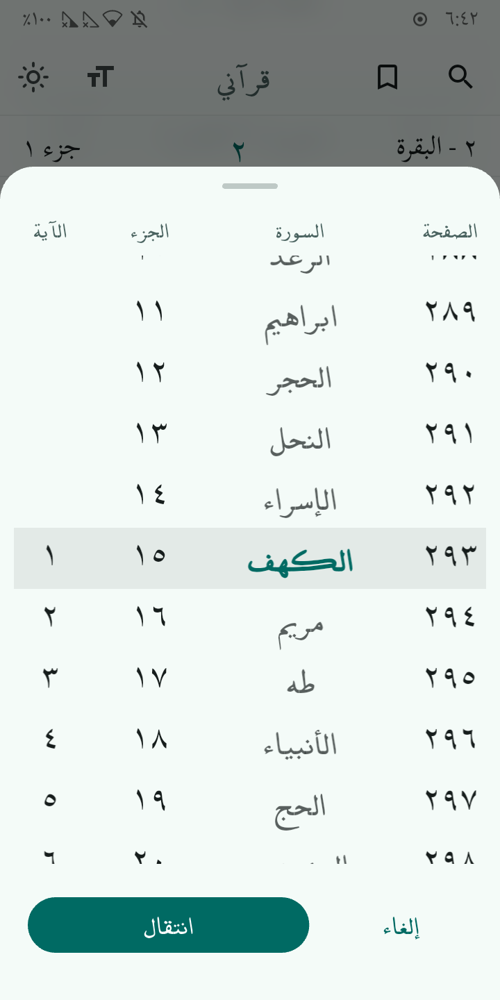

<div align="center">

  <!-- LOGO -->
  

  <br>

  #  My Quran | قرآني

  <!-- BADGES -->
  
  [](https://github.com/dmouayad/my_quran/releases/)

  A distraction-free, privacy-focused, and high-performance Quran application.
  <br><br>
  
  <!-- DOWNLOAD BUTTONS -->
  <div align="center">
  [](https://apt.izzysoft.de/fdroid/index/apk/com.dmouayad.my_quran)
  [](https://f-droid.org/packages/com.dmouayad.my_quran)
  [](https://github.com/dmouayad/my_quran/releases)
  </div>
</div>

---

## 📱 Screenshots / لقطات الشاشة

<div align="center">
  
  
  
</div>

---

## ✨ Features | المميزات

| English | العربية |
| :--- | :--- |
| **🚀 Ultra Lightweight**<br> optimized size (~17MB) using JSON assets and code splitting. | **🚀 خفيف جداً**<br> حجم صغير بفضل تقنيات ضغط البيانات، لا يستهلك مساحة الهاتف. |
| **📴 100% Offline**<br> No internet required. No tracking. No analytics. | **📴 يعمل بدون إنترنت**<br> خصوصية تامة، لا يوجد تتبع، ولا يحتاج اتصال بالشبكة. |
| **🔍 Smart Search**<br> Advanced search that ignores Diacritics (Tashkeel) and supports multi-word queries. | **🔍 بحث ذكي**<br> محرك بحث فوري. |
---

## 🛠 Technical Highlights


*   **Architecture:** Pure Flutter (No heavy state management libraries), using `ValueNotifier` and `ScrollablePositionedList` for maximum performance.
*   **Data:** The Quran text is stored as compressed JSON (`assets/quran.json`) loaded into memory via Isolates.
*   **Search:** Custom-built Inverted Index with Prefix Matching and Diacritic Normalization.

## 🔧 Building from Source

To build this app locally:

1.  **Clone the repo**
    ```bash
    git clone https://github.com/dmouayad/my_quran.git
    ```
2.  **Get dependencies**
    ```bash
    flutter pub get
    ```
3.  **Run the app**
    ```bash
    flutter run
    ```
4.  **Build Release APK** (Optimized)
    ```bash
    flutter build apk --release --obfuscate --split-debug-info=./debug-info
    ```

---

## 🤝 Contributing

Contributions are welcome! If you find a bug or have any improvement.

1.  Fork the Project
2.  Create your Feature Branch (`git checkout -b feature/AmazingFeature`)
3.  Commit your Changes (`git commit -m 'Add some AmazingFeature'`)
4.  Push to the Branch (`git push origin feature/AmazingFeature`)
5.  Open a Pull Request

## 📄 License

Distributed under the **GPL-3.0 License**. See `LICENSE` for more information.

## تمّ بفضل الله
