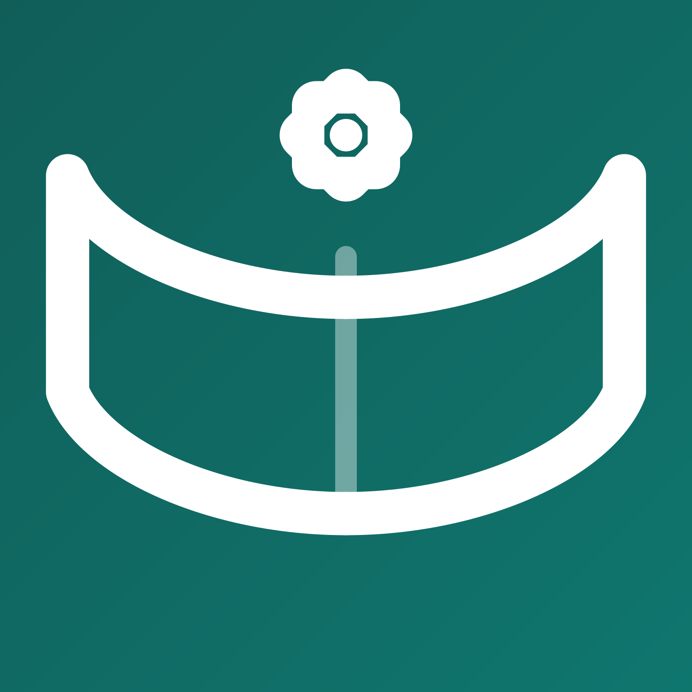

  <!-- LOGO -->
  
   

  #  My Quran | قرآني

  
  حجم صغير، خصوصية تامة، بحث سريع ولا يحتاج اتصال بالانترنت.
  
  Lightweight. Fast search. No internet required. No analytics.
  
  <!-- BADGES -->
  
  
  
  
  
  <!-- DOWNLOAD BUTTONS -->
  

  
  
  
   
   
  

  

---

  
  
  

---

  
**تمّ بفضل الله**

